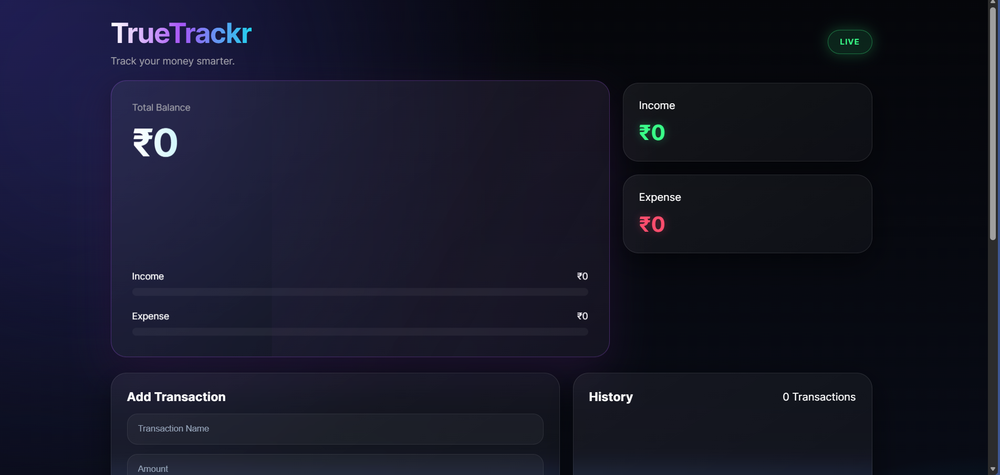

# 💎 TrueTrackr

### Modern finance made simple.

TrueTrackr is a modern personal finance tracker built using **HTML, CSS, JavaScript, and Chart.js**.  
It helps users manage income and expenses with real-time updates, interactive analytics, and a clean neon glassmorphism UI.

---

## 🌐 Live Demo

[Open TrueTrackr](https://koyalmaity007.github.io/TrueTracker/tracker.html)

---

## 🚀 Features

- Add Income & Expense Transactions
- Real-Time Balance Updates
- Interactive Analytics Dashboard
- Expense Breakdown Visualization
- Income vs Expense Comparison Charts
- Savings Rate Tracking
- Financial Health Insights
- Top Spending Category Detection
- Persistent Data Storage using LocalStorage
- Fully Responsive Design (Mobile + Desktop)
- Smooth UI Animations

---

## 📊 Tech Stack

- HTML5
- CSS3 (Glassmorphism + Neon UI)
- JavaScript (ES6+)
- Chart.js (Data Visualization)
- LocalStorage API

---
## 🖼️ Preview


---


## 📂 Project Structure

```
TrueTrackr/
│
├── trackerscreenshot.png
├── tracker.html
├── tracker.css
├── README.md
│
└── js/
    ├── tracker.js
    ├── charts.js
    ├── analytics.js
    └── main.js
```

---

## ⚙️ How It Works

1. Add income or expense entries
2. Data is stored in browser LocalStorage
3. Charts update in real-time using Chart.js
4. Dashboard recalculates balance, savings, and insights instantly

---

## 📱 Responsive Design

TrueTrackr is fully responsive and optimized for:
- Mobile phones
- Tablets
- Desktop screens

---

## 💡 Key Highlights

- No backend required
- Works fully in browser
- Instant financial insights
- Lightweight and fast
- Clean modern UI inspired by fintech apps

---

## 🧠 Future Improvements (Ideas)

- Cloud sync support
- Export to PDF/CSV
- Budget planning system
- User authentication
- Multi-device sync

---

## 📌 Note

All data is stored locally in your browser using LocalStorage. Clearing browser data will reset transactions.

---

## ⭐ Support

If you like this project, consider starring the repo and sharing it.

---

